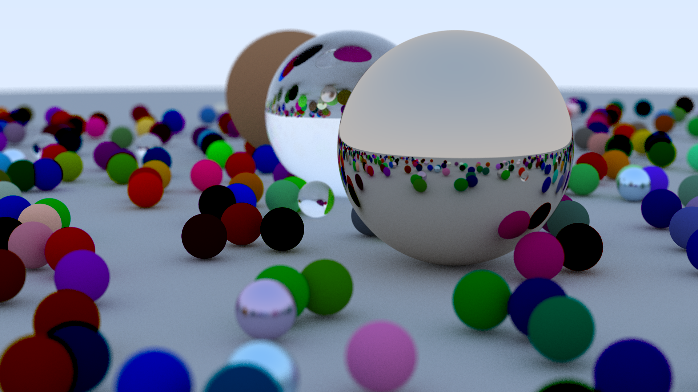

# Raytracing in One Weekend
Code for the book [Raytracing in One Weekend](https://raytracing.github.io/books/RayTracingInOneWeekend.html) in Rust. This was an excuse to get more comfortable writing Rust. I also added a progress bar, png export and multithreading

Run `cargo run` build and run the program. Running the program creates a .png image with a randomly generated scene. You can set some CLI parameters to change some stuff for the output image:

        USAGE:
        raytracing [OPTIONS]

    FLAGS:
            --help       Prints help information
        -V, --version    Prints version information

    OPTIONS:
        -h, --height <height>                               [default: 480]
        -o, --output-name <output-name>                     [default: image.png]
        -s, --samples-per-pixels <samples-per-pixels>       [default: 50]
        -v, --vertical-fov <vertical-fov>                   [default: 20.0]
        -w, --width <width>                                 [default: 640]

**Sample render at 1920x1080 with 50 samples per pixel** 
